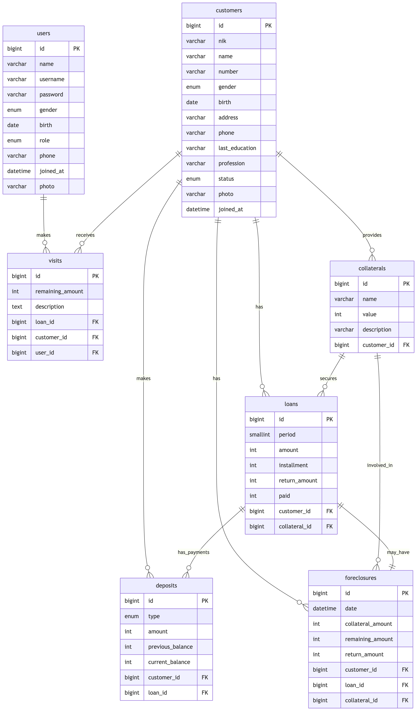

<p align="center">
  <a href="https://404notfound.fun" target="_blank">
    
  </a>
</p>

## Laravel Kosunu 🤑

Adalah sistem manajemen koperasi berbasis web yang dibangun dengan framework Laravel. Aplikasi ini dirancang untuk membantu pengelolaan operasional koperasi simpan pinjam secara digital, mencakup manajemen anggota, simpanan, pinjaman, dan pelacakan pembayaran.

## 🛢️ Skema Database



File database bisa didownload di [sini](docs/kosunu.sql).

## ⚡ Instalasi Super Cepat

### 🔥 Persyaratan

- [Docker](https://docs.docker.com/desktop/setup/install/windows-install/)

### 🚀 Menjalankan dengan Docker

Clone repository ini, lalu jalankan:

```sh
docker compose up -d
```

## 🔑 Login

Gunakan akun berikut buat masuk:

| Username | Password |
| -------- | -------- |
| manajer  | admin    |
| teller   | admin    |
| kolektor | admin    |

## Lisensi

Berlisensi di bawah [MIT License](LICENSE).
