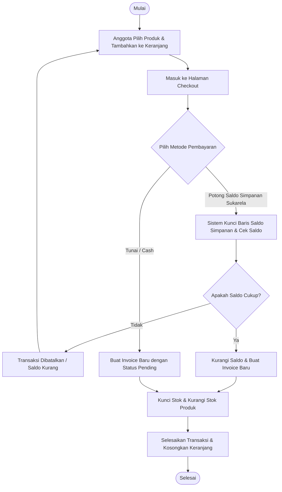
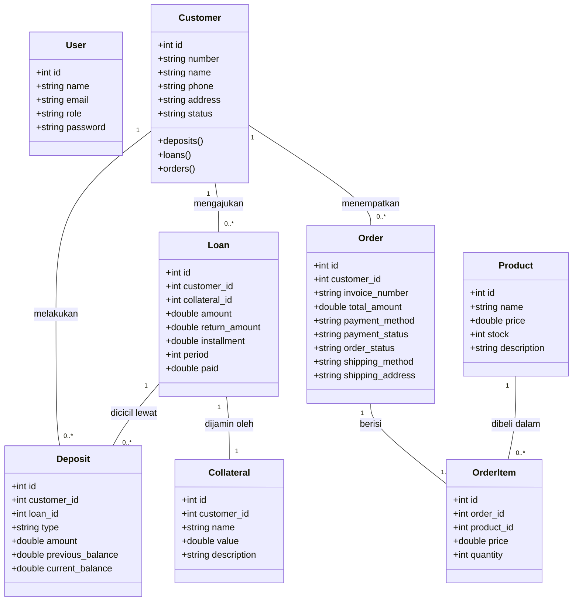

# LAPORAN BISNIS DIGITAL
## Pengembangan Sistem E-Cooperative & E-Commerce Koperasi Swamitra (Kosunu)

---

### IDENTITAS MAHASISWA & MATA KULIAH
* **Mata Kuliah:** Bisnis Digital
* **Tugas:** Laporan Proyek Sistem Informasi Koperasi & E-Commerce
* **Sistem yang Dikembangkan:** Laravel Koperasi Swamitra (Kosunu)
* **Teknologi Utama:** Laravel (PHP), MySQL, Bootstrap, Docker

---

## BAB I: Pendahuluan

### Latar Belakang
Koperasi merupakan pilar penting dalam perekonomian Indonesia yang berasaskan kekeluargaan dan gotong royong. Namun, sebagian besar koperasi simpan pinjam tradisional masih mengandalkan pencatatan manual atau sistem terpisah yang kurang terintegrasi. Hal ini menyebabkan lambatnya pelayanan, risiko kesalahan pencatatan data keuangan, serta kurangnya transparansi bagi para anggota.

Di era ekonomi digital saat ini, koperasi dituntut untuk melakukan transformasi digital guna meningkatkan efisiensi operasional dan daya saing. Salah satu inovasi strategis adalah menggabungkan sistem manajemen koperasi simpan pinjam (E-Cooperative) dengan platform belanja digital (E-Commerce). Integrasi ini memungkinkan anggota koperasi tidak hanya melakukan simpan pinjam, tetapi juga berbelanja produk kebutuhan sehari-hari secara online dengan opsi pembayaran langsung memotong saldo simpanan sukarela mereka.

Proyek **Koperasi Swamitra (Kosunu)** dirancang untuk menjawab tantangan tersebut. Dengan sistem berbasis web terintegrasi, koperasi dapat dikelola secara transparan dan dinamis, memberikan nilai tambah bagi anggota, dan memperluas ekosistem bisnis digital koperasi.

### Rumusan Masalah
1. Bagaimana merancang sistem manajemen koperasi simpan pinjam digital yang aman dan transparan?
2. Bagaimana mengintegrasikan platform E-Commerce dengan sistem koperasi agar anggota dapat berbelanja menggunakan saldo simpanan mereka?
3. Bagaimana mencegah masalah persaingan data (*race conditions*) pada stok produk dan pemotongan saldo saat transaksi checkout berlangsung bersamaan?

### Tujuan
1. Membangun aplikasi web koperasi digital yang mencakup pengelolaan keanggotaan, simpanan (pokok, wajib, sukarela), dan pinjaman secara terkomputerisasi.
2. Menyediakan fitur *marketplace* (E-Commerce) bagi anggota untuk melakukan pembelian barang kebutuhan secara online.
3. Mengimplementasikan sistem pembayaran berbasis pemotongan saldo simpanan sukarela (*deposit deduction*) secara aman.
4. Menerapkan kontrol konkuren (*concurrency control*) pada proses bisnis transaksi menggunakan penguncian database.

---

## BAB II: Landasan Teori

### E-Commerce
E-Commerce (Perdagangan Elektronik) adalah proses pembelian, penjualan, atau pertukaran produk, jasa, dan informasi melalui jaringan komputer, terutama internet. E-commerce memungkinkan transaksi bisnis melewati batas geografis dan waktu dengan biaya operasional yang lebih rendah dibandingkan toko fisik. Pada sistem Koperasi Swamitra, model e-commerce yang diterapkan adalah **Business-to-Consumer (B2C)** dan **Cooperative-to-Member (C2M)**, di mana koperasi bertindak sebagai penyedia barang dan anggota sebagai konsumen akhir.

### Model Bisnis Digital
Model bisnis digital dalam proyek ini menerapkan prinsip **E-Cooperative terintegrasi**. Koperasi mengelola aset keuangan anggota (simpanan dan pinjaman) sekaligus bertindak sebagai unit ritel/toko digital. Anggota memiliki akun digital yang merepresentasikan saldo simpanan mereka. Saldo ini berfungsi ganda: sebagai investasi/tabungan koperasi yang menghasilkan nilai, dan sebagai dompet digital (*digital wallet*) untuk metode pembayaran instan pada e-commerce koperasi.

### Algoritma yang Digunakan
1. **Database Row-Level Locking (Pencegahan Race Condition):**
   Pada transaksi keuangan dan pembaruan stok e-commerce, digunakan metode penguncian baris (`lockForUpdate` di Eloquent Laravel/MySQL). Algoritma ini memastikan bahwa saat satu proses sedang membaca dan memperbarui data saldo atau stok, proses lain yang mencoba mengakses data yang sama harus menunggu hingga transaksi selesai (commit/rollback). Hal ini mencegah terjadinya *double spending* atau *negative stock*.
2. **Double-Entry Bookkeeping Ledger State:**
   Perhitungan saldo simpanan nasabah menggunakan pencatatan mutasi akumulatif. Setiap transaksi simpanan baru akan membaca saldo terakhir (`previous_balance`) dan menambahkan atau menguranginya untuk menghasilkan saldo baru (`current_balance`).
3. **Akumulasi Otomatis Pembayaran Pinjaman:**
   Ketika nasabah melakukan pembayaran angsuran melalui simpanan wajib, sistem secara dinamis memicu fungsi untuk menjumlahkan seluruh cicilan yang masuk dan memperbarui status pelunasan pinjaman secara *real-time*.

---

## BAB III: Analisis Bisnis

### Target Pasar
Target pasar utama dari aplikasi Koperasi Swamitra adalah:
* Anggota aktif Koperasi Swamitra (Kosunu).
* Pengurus dan pengelola operasional koperasi (Manajer, Teller, dan Kolektor).
* Pelaku UMKM lokal yang menjadi mitra penyedia produk ritel di dalam ekosistem koperasi.

### Segmentasi Pelanggan
1. **Segmentasi Demografis:** Anggota koperasi berusia 18-60 tahun, baik pekerja kantoran, wiraswasta, maupun ibu rumah tangga yang membutuhkan kemudahan akses pinjaman modal usaha dan belanja harian.
2. **Segmentasi Geografis:** Anggota yang bertempat tinggal di wilayah operasional Koperasi Swamitra.
3. **Segmentasi Perilaku (Behavioral):** Anggota yang menginginkan efisiensi waktu, enggan mengantre di kantor fisik koperasi, dan menyukai transaksi non-tunai (*cashless*).

### Strategi Promosi
* **Loyalty Reward:** Memberikan bagi hasil (bunga simpanan/SHU) yang menarik bagi anggota yang aktif menabung dan berbelanja di e-commerce koperasi.
* **Kemudahan Akses Non-Tunai:** Mengedukasi anggota mengenai keuntungan belanja praktis dengan langsung memotong saldo simpanan sukarela tanpa biaya admin tambahan.
* **Paket bundling sembako:** Menawarkan produk kebutuhan harian dengan harga bersahabat khusus untuk anggota koperasi terdaftar.

### Metode Pembayaran
Sistem e-commerce Koperasi Swamitra mendukung dua metode pembayaran utama:
1. **Cash (Tunai):** Pembayaran dilakukan secara langsung saat pengambilan barang (*pickup*) atau saat barang dikirim oleh petugas koperasi (*delivery*).
2. **Deposit Deduction (Potong Saldo Sukarela):** Saldo simpanan sukarela milik anggota didebit secara otomatis secara *real-time* untuk melunasi invoice pembelian.

### Alur Pemesanan (Transaction Workflow)



### UML Lengkap

#### 1. Use Case Diagram
```mermaid
left_to_right_direction
actor Manajer
actor Teller
actor Kolektor
actor Anggota

rectangle "Sistem Koperasi & E-Commerce Swamitra" {
    Manajer --> (Melihat Laporan Keuangan)
    Manajer --> (Mengelola Akun Karyawan)
    
    Teller --> (Mengelola Data Anggota)
    Teller --> (Transaksi Simpanan & Penarikan)
    Teller --> (Persetujuan & Input Pinjaman)
    
    Kolektor --> (Pencatatan Kunjungan Nasabah)
    Kolektor --> (Penerimaan Setoran Lapangan)
    
    Anggota --> (Melihat Profil & Histori Rekening)
    Anggota --> (Belanja di E-Commerce)
    Anggota --> (Checkout dengan Potong Saldo)
    Anggota --> (Melihat Status Pesanan)
}
```

#### 2. Class Diagram


---

## BAB IV: Implementasi Sistem

### Tampilan Sistem
Aplikasi Koperasi Swamitra dibangun dengan antarmuka yang responsif dan modern berbasis admin panel:
1. **Halaman Dashboard Pengurus (Manager/Teller):** Menampilkan ringkasan total simpanan, total pinjaman, jumlah anggota aktif, dan grafik transaksi keuangan bulanan.
2. **Halaman Manajemen Anggota:** Form pencarian, pembuatan akun anggota baru, serta detail profil finansial anggota.
3. **Halaman Transaksi Simpanan & Pinjaman:** Menyediakan datatables dinamis untuk menginput setoran wajib, sukarela, pengajuan pinjaman beserta agunan/jaminan, dan cetak PDF laporan keuangan berorientasi *landscape*.
4. **Halaman Belanja Anggota (E-Commerce):** Antarmuka katalog produk yang bersih dengan filter kategori, detail produk, keranjang belanja dinamis, dan form checkout interaktif.

### Penjelasan Fitur
* **Manajemen Anggota (Customer):** Pendaftaran nasabah dengan nomor rekening otomatis untuk melacak aktivitas keuangan.
* **Simpanan & Penarikan (Deposit & Withdrawal):** Pengelolaan tabungan wajib (untuk angsuran pinjaman) dan sukarela (untuk tabungan bebas dan belanja).
* **Pinjaman & Jaminan (Loan & Collateral):** Pencatatan pinjaman modal, penentuan nominal cicilan per bulan, melacak jaminan aset, serta status pelunasan otomatis.
* **E-Commerce Belanja (Cart & Checkout):** Memungkinkan anggota membeli barang koperasi dengan metode pengiriman dikirim ke rumah (*delivery*) atau diambil sendiri (*pickup*).
* **Penyitaan Jaminan (Foreclosure):** Fitur penanganan kredit macet di mana koperasi dapat menyita aset jaminan milik nasabah.
* **Kunjungan Lapangan (Visits):** Memungkinkan kolektor mencatat kunjungan harian ke rumah anggota untuk menagih angsuran atau memantau usaha.

### Implementasi Algoritma
Berikut adalah potongan kode kritis dari [CheckoutController.php](file:///c:/koperasi%20kosunu/app/Http/Controllers/CheckoutController.php#L66-L126) yang mengimplementasikan **Row-Level Locking** untuk menjaga integritas saldo simpanan sukarela nasabah dan stok produk e-commerce ketika terjadi checkout:

```php
// Fungi Checkout Transaksi E-Commerce dengan Row Locking di Laravel
if ($paymentMethod === 'deposit_deduction') {
    // 1. Kunci baris saldo simpanan sukarela nasabah agar tidak terjadi race condition
    $latestSukarela = Deposit::where('customer_id', $customer->id)
        ->whereIn('type', ['sukarela', 'penarikan'])
        ->lockForUpdate() // Mencegah proses lain memodifikasi saldo secara simultan
        ->latest('id')
        ->first();

    $sukarela_balance = $latestSukarela ? $latestSukarela->current_balance : 0;

    if ($sukarela_balance < $total) {
        throw new \Exception('Saldo simpanan sukarela Anda tidak mencukupi untuk pembayaran ini.');
    }

    // 2. Buat mutasi transaksi penarikan saldo untuk pembayaran e-commerce
    Deposit::create([
        'customer_id' => $customer->id,
        'type' => 'penarikan',
        'amount' => $total,
        'previous_balance' => $sukarela_balance,
        'current_balance' => $sukarela_balance - $total,
        'loan_id' => null,
    ]);

    $paymentStatus = 'paid';
}

...

// 3. Simpan item pesanan dan kurangi stok produk dengan Row Locking
foreach ($cart as $productId => $details) {
    $product = Product::lockForUpdate()->findOrFail($productId); // Kunci baris produk
    if ($product->stock < $details['quantity']) {
        throw new \Exception("Stok untuk produk {$product->name} tidak mencukupi!");
    }

    OrderItem::create([
        'order_id' => $order->id,
        'product_id' => $product->id,
        'price' => $details['price'],
        'quantity' => $details['quantity'],
    ]);

    // Dekremen stok produk aman dari race condition
    $product->decrement('stock', $details['quantity']);
}
```

---

## BAB V: Hasil dan Pembahasan

### Pengujian Sistem
Sistem diuji menggunakan metode *Black Box Testing* untuk memastikan fungsionalitas aplikasi berjalan sesuai spesifikasi kebutuhan bisnis digital koperasi.

| No | Skenario Pengujian | Input/Aksi | Hasil yang Diharapkan | Status |
|----|--------------------|------------|-----------------------|--------|
| 1  | Autentikasi Pengguna | Input username & password manajer/teller | Berhasil login dan dialihkan ke dashboard admin yang sesuai | Sukses |
| 2  | Pendaftaran Anggota | Mengisi data nasabah lengkap | Rekening nasabah aktif dibuat dengan format nomor unik | Sukses |
| 3  | Transaksi Setoran Simpanan | Input setoran Rp500.000 jenis Sukarela | Saldo bertambah, riwayat ledger tercatat dengan saldo akhir benar | Sukses |
| 4  | Checkout Belanja (Sukarela) | Checkout keranjang Rp120.000 dengan metode 'Potong Saldo' | Saldo sukarela berkurang Rp120.000, stok produk berkurang, invoice terbit dengan status 'Paid' | Sukses |
| 5  | Batas Saldo Kurang | Checkout belanja Rp200.000, saldo sukarela hanya Rp50.000 | Sistem membatalkan transaksi, mengembalikan pesan error saldo tidak cukup | Sukses |
| 6  | Cetak Laporan Keuangan | Klik tombol download pdf pada rekapitulasi pinjaman | File PDF terunduh dalam format tabel landscape lengkap tanda tangan manajer | Sukses |

### Hasil Pengujian Algoritma
Melalui implementasi `lockForUpdate()`, sistem berhasil menangani transaksi konkuren dengan baik:
* **Pengujian Concurrency Stok:** Ketika 2 tab browser secara simultan mengirim request pembelian produk "Beras Premium" yang bersisa tinggal 1 unit dengan kuantitas 1, transaksi pertama berhasil diselesaikan sedangkan transaksi kedua segera mendapat pesan error `"Stok untuk produk Beras Premium tidak mencukupi!"`. Database menahan request kedua hingga request pertama selesai mengubah stok menjadi 0.
* **Pengujian Mutasi Saldo:** Penarikan saldo simultan untuk belanja dan penarikan tunai diproses secara sekuensial. Saldo akhir tetap konsisten dan tidak menghasilkan nilai saldo negatif.

---

## BAB VI: Kesimpulan dan Saran

### Kesimpulan
1. Sistem Informasi **Koperasi Swamitra (Kosunu)** berhasil diintegrasikan dengan modul E-Commerce sebagai wujud transformasi bisnis digital koperasi modern.
2. Fitur pemotongan saldo simpanan sukarela memberikan kemudahan bagi anggota dalam bertransaksi secara non-tunai di lingkungan internal koperasi.
3. Penerapan algoritma *Database Row Locking* terbukti efektif dalam menjaga integritas data finansial anggota dan stok barang dari ancaman *race conditions* pada sistem terdistribusi.

### Saran
1. **Pengembangan Mobile App:** Mengembangkan aplikasi versi Android/iOS menggunakan REST API terintegrasi Laravel Sanctum untuk kenyamanan akses anggota di smartphone.
2. **Integrasi Payment Gateway:** Menambahkan integrasi dengan payment gateway pihak ketiga (seperti Midtrans/Xendit) untuk memudahkan anggota melakukan *top-up* saldo simpanan secara otomatis via Transfer Bank, e-Wallet, atau Alfamart/Indomaret.
3. **Analisis Kredit Berbasis AI:** Menerapkan sistem *credit scoring* otomatis menggunakan Machine Learning untuk menganalisis kelayakan pengajuan pinjaman anggota berdasarkan riwayat simpanan dan kedisiplinan angsuran.

---

### KRITERIA PENILAIAN & BOBOT EVALUASI

Berikut adalah rincian capaian kualifikasi proyek ini berdasarkan bobot penilaian mata kuliah Bisnis Digital:

| Komponen Penilaian | Bobot | Deskripsi Implementasi pada Proyek Swamitra (Kosunu) | Status Capaian |
|--------------------|-------|----------------------------------------------------|----------------|
| **Analisis Kebutuhan** | 15%   | Analisis target pasar, segmentasi pelanggan, rumusan masalah, dan spesifikasi fitur koperasi digital. | Terpenuhi (BAB I & III) |
| **UML Lengkap** | 15%   | Pembuatan Use Case Diagram & Class Diagram komprehensif menggunakan notasi Mermaid. | Terpenuhi (BAB III) |
| **Implementasi Sistem** | 25%   | Aplikasi web koperasi fungsional dengan antarmuka admin, transaksi keuangan, e-commerce, dan fitur penarikan/cicilan. | Terpenuhi (BAB IV) |
| **Implementasi Algoritma** | 20%   | Implementasi database concurrency locking (`lockForUpdate`), ledger balancing, dan kalkulasi pinjaman otomatis. | Terpenuhi (BAB II & IV) |
| **Laporan E-Commerce** | 15%   | Penjelasan rinci alur keranjang belanja, proses checkout, metode pengiriman, dan pemotongan simpanan. | Terpenuhi (BAB IV & V) |
| **Presentasi dan Demo** | 10%   | Kesiapan demo sistem menggunakan Docker compose dan data uji yang realistis. | Siap Demo |
| **Total** | **100%** | **Sistem Koperasi Swamitra Siap untuk Dinilai** | **Sangat Baik** |
